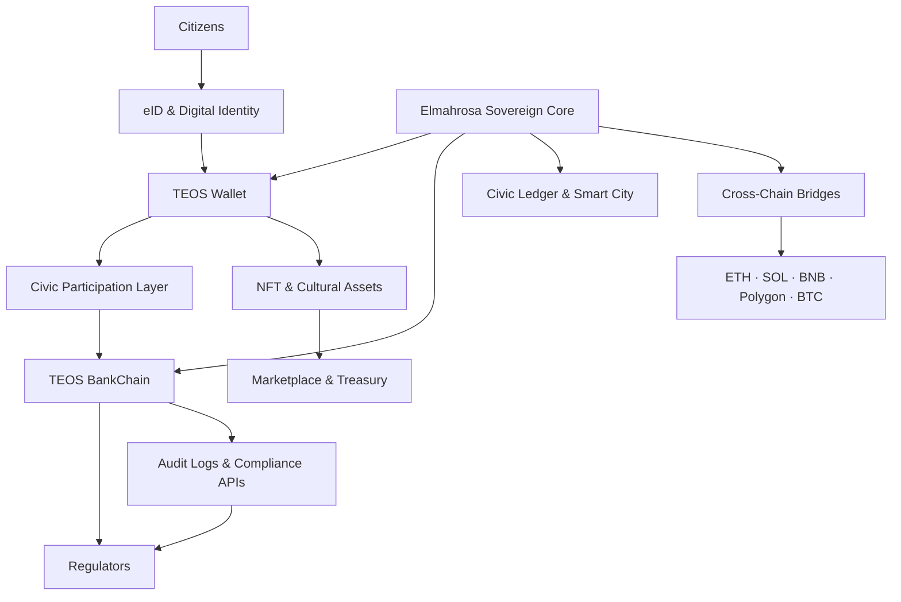

# 📍 Repo Standing Statement

This repository is a **sovereign original** under **Elmahrosa International — TEOS Egypt**.  
Governance is anchored in [TEOS-FORGE](https://github.com/Elmahrosa/TEOS-FORGE).  
Commercial use requires written approval from Elmahrosa International.  

⚖️ Protected under dual license: PolyForm Noncommercial + TEOS Egypt Sovereign License (TESL).

# ?? Repo Standing Statement

This repository is a **sovereign original** under **Elmahrosa International � TEOS Egypt**.  
Governance is anchored in [TEOS-FORGE](https://github.com/Elmahrosa/TEOS-FORGE).  
Commercial use requires written approval from Elmahrosa International.  

?? Protected under dual license: PolyForm Noncommercial + TEOS Egypt Sovereign License (TESL).

# 🏛 Elmahrosa International — TEOS Sovereign Civic Blockchain

**Sovereign Digital Public Infrastructure (DPI)**
**Built for Governments, Central Banks & Global Institutions**

**Multi-Chain · Audit-Ready · Regulator-Aligned · DPI-Certified**

**Public Repositories:** [43+](https://github.com/orgs/Elmahrosa/repositories)
**Followers:** 

---

## 📘 Overview

**TEOS (The Elmahrosa Operating System)** is a **sovereign, civic-first blockchain ecosystem** engineered in Egypt and designed for **national-scale digital transformation**.

It delivers **Digital Public Infrastructure (DPI)** spanning:

* Civic identity & governance
* Regulated banking & tokenized finance
* Smart cities & mobility
* Asset-backed economies
* Cultural & AI-driven innovation

Built **solo** by **Ayman Seif**, TEOS is architected for **institutional adoption**, **regulatory alignment**, and **UN SDG–measurable impact**.

---

## 🎯 Mission Statement

> **To provide nations with sovereign, audit-ready blockchain infrastructure that preserves autonomy, enables trust, and scales globally—without dependence on foreign control layers.**

---

## 🧱 System Architecture (High-Level)

---

## 🌐 Live Ecosystem

### Official Platforms

* 🌐 Whitepaper — [https://whitepaper.teosegypt.com](https://whitepaper.teosegypt.com)
* 🏛 TEOS Egypt — [https://www.teosegypt.com](https://www.teosegypt.com)
* 🧠 AI Studio — [https://studioai.teosegypt.com](https://studioai.teosegypt.com)

### DApps & Services

* 🏦 BankChain — [https://bankchain.teosegypt.com](https://bankchain.teosegypt.com)
* 🚕 Pi Taxi — [https://teospitaxi.teosegypt.com](https://teospitaxi.teosegypt.com)
* 🌆 Smart City — [https://smartcity.teosegypt.com](https://smartcity.teosegypt.com)
* 🗺 eMap of Pi — [https://emapofpi.teosegypt.com](https://emapofpi.teosegypt.com)
* 🪙 Nilex DEX — [https://nilex.teosegypt.com](https://nilex.teosegypt.com)
* 💼 TEOS Wallet — [https://wallet1.teosegypt.com](https://wallet1.teosegypt.com)
* 🛠 Earn — [https://earn.teosegypt.com](https://earn.teosegypt.com)
* ⛏ Mine — [https://mine.teosegypt.com](https://mine.teosegypt.com)
* 🖼 NFT Hub — [https://nft.teosegypt.com](https://nft.teosegypt.com)
* 🚀 Pump Engine — [https://pump.teosegypt.com](https://pump.teosegypt.com)
* 🎁 Airdrop — [http://airdrop.teosegypt.com](http://airdrop.teosegypt.com)
* 🤖 Automation — [http://bot.teosegypt.com](http://bot.teosegypt.com)

### Institutional Portals

* 🏦 Bank Portal — [https://bank.teosegypt.com](https://bank.teosegypt.com)
* 🧪 Regulatory Labs — [https://fact.teosegypt.com](https://fact.teosegypt.com)
* 🔐 FPBE Pi Bank — [https://fpbe.teosegypt.com](https://fpbe.teosegypt.com)
* 📊 Live Metrics — [https://live.teosegypt.com](https://live.teosegypt.com)

---

## 📊 Executive Summary

**TEOS Egypt** is a **production-ready sovereign blockchain portfolio** consisting of **17 deployed DApps** and **43+ public repositories**, currently live as **Pi Network demos** with verification in progress.

### Key Differentiators

* **Sovereign-by-Design**: No dependency on foreign L1 governance
* **Compliance-First**: TESL v2.0 licensing, audit logs, regulator APIs
* **DPI-Aligned**: Identity, payments, governance, infrastructure
* **SDG-Mapped**: Measurable UN impact across all verticals
* **Multi-Chain Ready**: ETH, Solana, BNB, Polygon, BTC
* **Cultural Layer**: Egyptian heritage as a digital economic asset

**Built solo. Designed for nations. Ready for institutions.**

---

## 🧩 Portfolio Categories

### 🌍 Civic & Governance

Identity, participation, and transparent civic systems.

| DApp             | Purpose                         | SDGs       |
| ---------------- | ------------------------------- | ---------- |
| ASK TEOS AI      | Sovereign civic AI gateway      | SDG 4, 16  |
| TEOS Civic Mixer | Identity & participation hub    | SDG 10, 16 |
| Civic Ledger     | Constitutional & civic records  | SDG 16, 17 |
| Civic Gaza       | Post-conflict digital framework | SDG 11, 16 |

---

### 💳 Banking & Finance

Regulated financial rails and sovereign liquidity.

| DApp               | Purpose                      | SDGs      |
| ------------------ | ---------------------------- | --------- |
| TEOS BankChain     | Core regulated banking layer | SDG 8, 9  |
| Bank of Pi Egypt   | National digital bank        | SDG 8, 17 |
| First Pi Misr Bank | Local sovereign node         | SDG 8, 9  |
| Nilex DEX          | Decentralized exchange       | SDG 8, 10 |
| TEOS Wallet        | Non-custodial wallet         | SDG 9, 10 |

---

### 🚖 Smart Mobility & Cities

Urban infrastructure and mobility.

| DApp            | Purpose                 | SDGs       |
| --------------- | ----------------------- | ---------- |
| TEOS Pi Taxi    | Blockchain ride-hailing | SDG 11, 13 |
| TEOS Smart City | Urban governance        | SDG 11, 13 |
| eMap of Pi      | Geospatial services     | SDG 11, 17 |

---

### ⚒️ Resources & Economy

Asset-backed and productive economies.

| DApp             | Purpose              | SDGs      |
| ---------------- | -------------------- | --------- |
| MINE-TEOS        | Sovereign mining     | SDG 7, 8  |
| Elmahrosa Mining | National node        | SDG 7, 8  |
| TGR Gold Reserve | Tokenized gold (1g)  | SDG 8, 12 |
| TEOS Pump        | Liquidity & presales | SDG 8, 9  |

---

### 🎨 Creative & Cultural

AI + NFTs for cultural sovereignty.

| DApp               | Purpose              | SDGs     |
| ------------------ | -------------------- | -------- |
| TEOS NFT Generator | Cultural NFT minting | SDG 4, 8 |

---

## 🌍 SDG Impact Framework

TEOS aligns with **Egypt Vision 2030** and **UN SDGs**, providing **measurable dashboards** for:

* Education
* Financial inclusion
* Infrastructure
* Sustainable cities
* Institutional trust

---

## 🛣 Roadmap

* **Q1 2026** — Pi verification & Solana mainnet
* **Q2 2026** — Hong Kong & institutional pilots
* **Q3 2026** — Africa & MENA expansion
* **Ongoing** — Government POCs & white-label deployments

---

## 👤 Founder & Authority

**Ayman Seif**
Founder & Sole Architect — Elmahrosa International

* 📧 [ayman@teosegypt.com](mailto:ayman@teosegypt.com)
* 📞 +20 100 616 7293
* 💬 Telegram: [https://t.me/Elmahrosapi](https://t.me/Elmahrosapi)
* 📄 Whitepaper: [https://whitepaper.teosegypt.com](https://whitepaper.teosegypt.com)

---

## ⚡ Final Statement

> **Every commit is a civic milestone.**
> **Built solo in Egypt. Engineered for nations. Scaled for the world.**

**License:** TESL v2.0
© Elmahrosa International — All Rights Reserved

## ?? Integration Summary
This repository is part of the **Elmahrosa Sovereign Stack**.  
Governance is anchored in **TEOS-FORGE**, with integrations across Bankchain, ERT-LAUNCH, FPBE, and other civic modules.  
See full details in [docs/integrations.md](https://github.com/Elmahrosa/TEOS-FORGE/blob/main/docs/integrations.md).

## 🔗 Integration Summary
This repository is part of the **Elmahrosa Sovereign Stack**.  
Governance is anchored in **TEOS-FORGE**, with integrations across Bankchain, ERT-LAUNCH, FPBE, and other civic modules.  
See full details in [docs/integrations.md](https://github.com/Elmahrosa/TEOS-FORGE/blob/main/docs/integrations.md).
