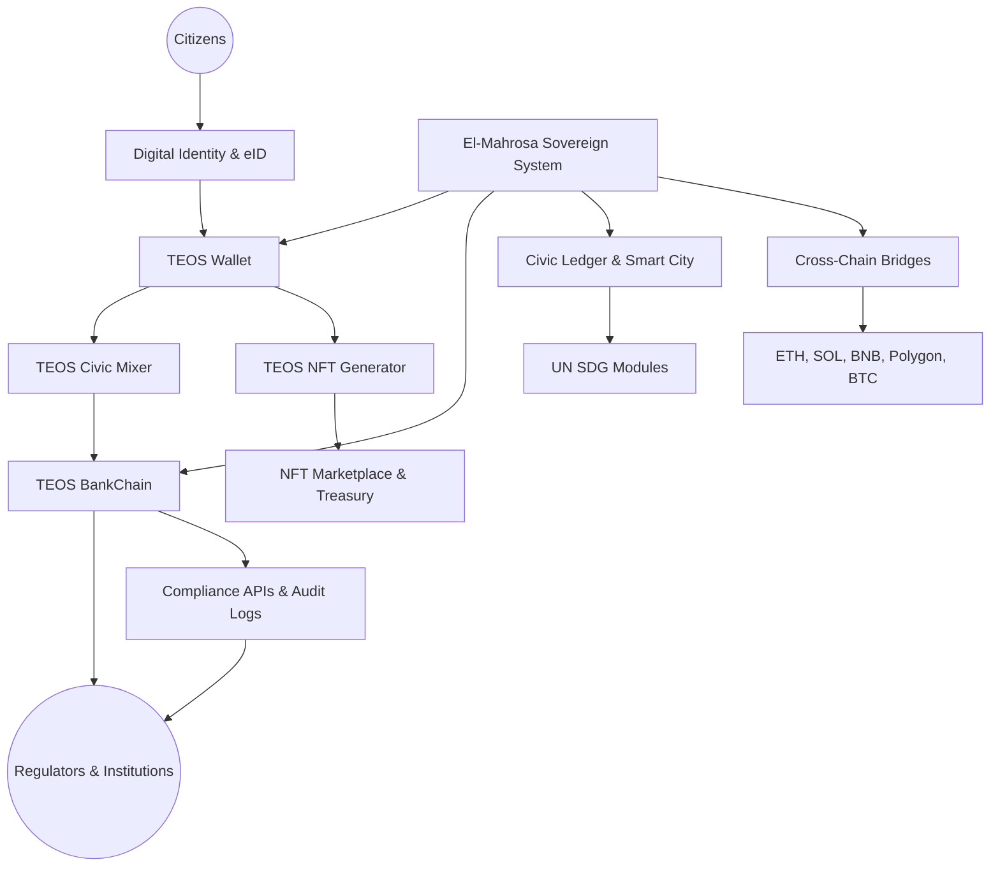

# 🏛 Elmahrosa International — TEOS Egypt

### Sovereign Civic Blockchain Infrastructure | Engineered in Egypt — Built for the World

**Sovereign blockchain infrastructure | Civic impact | Regulator-aligned | Open source**
**Official Whitepaper** · **Petition – 580+ Signatures**
**Last Updated:** January 2026
**Public Repositories:** 43+ · **Followers:** 
**Built solo by Ayman Seif**

---

## 📘 Table of Contents

* [System Architecture](#system-architecture)
* [Overview](#overview)
* [Mission Statement](#mission-statement)
* [Core Values](#core-values)
* [Key Areas of Focus](#key-areas-of-focus)
* [Current Projects](#current-projects)
* [Deployments](#deployments)
* [Compliance & Standards](#compliance--standards)
* [Founder Badges](#founder-badges)
* [Contact & Verification](#contact--verification)

---

## 🧩 System Architecture

---

## 🌍 Overview

Elmahrosa International is a **civic-first blockchain organization based in Egypt**, deploying sovereign platforms that combine:

* Regulator-grade compliance
* Institutional wallet infrastructure
* SDG-measurable civic impact modules
* Cross-chain global interoperability
* Audit-ready CI/CD delivery pipelines

Built and maintained by a **solo founder**, engineered for **national digital sovereignty**, structured for **global deployment and institutional adoption**.

---

## 🎯 Mission Statement

* **Compliance-First:** TESL v2.0 licensing, immutable audit logs, automated governance
* **Empowerment:** Secure blockchain rails for citizens, banks, fintechs, and civic institutions
* **Global Scalability:** Architected in Egypt, deployable worldwide — Africa → Middle East → Europe → Americas
* **Civic Leadership:** Position Egypt as a core contributor to global civic blockchain infrastructure

---

## 🔐 Core Values

* **Integrity:** Transparent governance, verifiable commits, regulator alignment
* **Excellence:** Production-hardened, tested, audit-ready repositories
* **Sustainability:** Modules deliver measurable UN SDG impact
* **Sovereignty:** Built in Egypt, owned by Egyptians, serving global infrastructure needs

---

## 🏦 Key Areas of Focus

### 1. Bank-Facing Crypto Gateways

* Wallet onboarding
* Treasury & settlements
* Staking & settlement rails
* Compliance dashboards
* Institutional API gateways

### 2. UN SDG Impact Modules

| SDG    | Module                             |
| ------ | ---------------------------------- |
| **2**  | Smart agriculture & food security  |
| **4**  | Digital education & learning rails |
| **12** | Circular economy & sustainability  |
| **13** | Carbon & climate tracking          |

### 3. Deployment Models

* SaaS infrastructure
* White-label national pilots
* Institutional POCs
* Cross-chain expansions

---

## 🚀 Current Projects

* **TEOS NFT dApp (Pi Network):** Egyptian-branded NFT minting, petition-first onboarding, staking rewards, treasury & marketplace flows
* **TEOS BankChain:** Regulated banking backbone, global pilot integration
* **Governance Automation:** Immutable audit dashboards, contributor verification, deployment integrity checks
* **Map of Pi Services:** Geospatial service index
* **Humanitarian Infra:** Digital reconstruction blueprints

---

## 🌐 Deployments

* PiNet sovereign demos for institutional review
* TEOS NFT minting & marketplace
* BankChain regulated finance pilot
* Governance & compliance dashboards

---

## 📜 Compliance & Standards

* TESL v2.0 enforced across all repos
* Immutable audit logs
* Regulator-aligned civic automation
* Institutional-safe infrastructure rails

---

## 🏅 Founder Badges

**Solo founder delivering sovereign infrastructure with global scale**

| Badge                   | Meaning                                 |
| ----------------------- | --------------------------------------- |
| **Civic Builder**       | Architects & codes all civic modules    |
| **Compliance Guardian** | Enforces TESL v2.0 & audit integrity    |
| **SDG Innovator**       | Designs measurable UN SDG impact        |
| **Treasury Steward**    | Manages staking, rewards, treasury      |
| **Global Deployer**     | Scales Egypt’s infrastructure worldwide |

---

## 📩 Contact & Verification

**Founder & Sole Developer:** Ayman Seif

* **Email:** [ayman@teosegypt.com](mailto:ayman@teosegypt.com)
* **Phone:** +20 1006167293
* **Solana Wallet:** `Akvm3CbDN448fyD8qmQjowgBGpcYZtjuKFL4xT8PZhbF`
* **TEOS Token Mint:** `AhXBUQmbhv9dNoZCiMYmXF4Gyi1cjQthWHFhTL2CJaSo`
* **Telegram:** `@Elmahrosapi`

---

### ⚡ Final Tagline

> **Every commit is a civic milestone.**
> Built solo in Egypt — scaled for the world.

---
