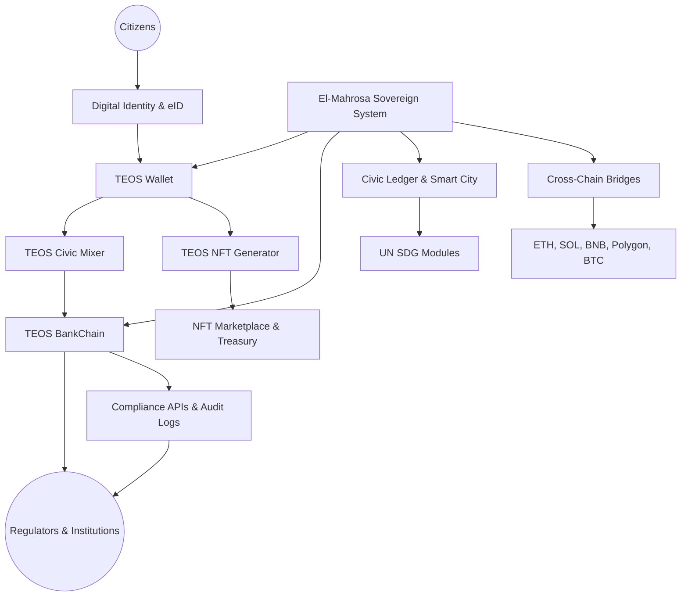

# 🏛 **Elmahrosa International — TEOS Egypt**

### **Engineered in Egypt, for the World**

---

## 🏛 Elmahrosa Organization

Welcome to the **Elmahrosa Sovereign Ecosystem**, a civic-first blockchain organization built in **Egypt**, designed to scale globally with compliance, sustainability, and institutional trust.

---

## 🔗 Core Repositories

| Repository                           | Purpose                            |
| ------------------------------------ | ---------------------------------- |
| **El-Mahrosa.Teos-Sovereign-System** | National sovereign backbone        |
| **TeosWallet**                       | Non-custodial citizen wallet       |
| **Teos-BankChain**                   | Regulated financial infrastructure |
| **TEOS-NFT-AI-Generator**            | NFT minting & AI generation        |
| **Ask-TEOS-AI**                      | AI blockchain gateway              |

> **All repositories are architected, coded, deployed, and maintained solo by the founder — every commit is self-delivered.**

---

## 🌍 Vision

A **sovereign digital infrastructure layer**, built in Egypt and aligned with:

* **Egypt Vision 2030**
* **UN Sustainable Development Goals**
* **Global audit and compliance standards**

Elmahrosa’s mission is to **anchor Egypt as a founding node in global civic blockchain infrastructure**, contributing to the world’s future constitutional digital layer.

---

## 🧩 System Architecture

---

## 🌍 Overview

**Elmahrosa International** is a civic-first blockchain organization based in Egypt, deploying sovereign platforms that fuse:

* **Regulator-grade compliance**
* **Institutional wallet infrastructure**
* **SDG-measurable impact modules**
* **Cross-chain global interoperability**
* **Audit-ready delivery pipelines**

This ecosystem is built by a **solo founder**, engineered for national sovereignty but structured for **worldwide deployment and adoption**.

---

## ✨ Mission Statement

* **Compliance-First:** Institutional trust through TESL v2.0 licensing, audit logs, and governance automation.
* **Empowerment:** Deliver secure blockchain infrastructure for citizens, banks, fintechs, and civic institutions.
* **Global Scalability:** Architected in Egypt, deployable anywhere — from Africa to the Middle East, Europe, and the Americas.
* **Civic Leadership:** Position Egypt as a **co-author and infrastructure contributor** to global civic blockchain evolution.

---

## 🏛 Core Values

* **Integrity:** Transparent governance, verifiable commits, regulator alignment.
* **Excellence:** Audit-ready repositories, tested and production-hardened.
* **Sustainability:** Every module delivers measurable SDG impact.
* **Sovereignty:** Built in Egypt, owned by Egyptians, serving global infrastructure needs.

---

## 🔧 Key Areas of Focus

* **Bank-Facing Crypto Gateways:** Wallet onboarding, treasury, staking, settlement, compliance dashboards.
* **SDG Modules:**

  * Carbon & climate tracking (SDG 13)
  * Smart agriculture & food security (SDG 2)
  * Digital education (SDG 4)
  * Circular economy & sustainability (SDG 12)
* **Global Deployment Models:** SaaS, white-label, institutional pilots, and cross-chain expansions.

---

## 🌐 Current Projects

* **TEOS NFT dApp (Pi Network):** Egyptian-branded NFT minting, petition-first onboarding, staking rewards, treasury flows, marketplace.
* **TEOS BankChain:** Global pilot for regulated banking integration.
* **Governance Automation:** Audit dashboards, contributor credentials, deployment integrity checks.

---

## 🚀 Deployments

* **PiNet sovereign demos** for institutional review
* **TEOS NFT platform**
* **BankChain global pilot**
* **Governance & compliance dashboards**

---

## 🔐 Compliance & Standards

---

## 📜 Licensing

**TESL v2.0** enforced across all repos
*Audit-ready · regulator-aligned · evergreen infrastructure*

---

## 📬 Contact & Verification

**Ayman Seif** — Founder & Sole Developer

* **Email:** [ayman@teosegypt.com](mailto:ayman@teosegypt.com)
* **Phone:** +20 1006167293
* **Solana Wallet:** Akvm3CbDN448fyD8qmQjowgBGpcYZtjuKFL4xT8PZhbF
* **TEOS Token Mint:** AhXBUQmbhv9dNoZCiMYmXF4Gyi1cjQthWHFhTL2CJaSo
* **Telegram :** @Elmahrosapi

---

# 🏅 Founder Badges

**Solo founder delivering sovereign infrastructure with global scale:**

*Architecting and coding every civic-first module.*

*Enforcing TESL v2.0 and audit integrity.*

*Designing measurable UN SDG impact modules.*

*Managing staking, rewards, and treasury flows.*

*Scaling Egypt’s blockchain infrastructure worldwide.*

---

### **Every commit is a civic milestone.**

### *Built solo in Egypt — scaled for the world.*

---
