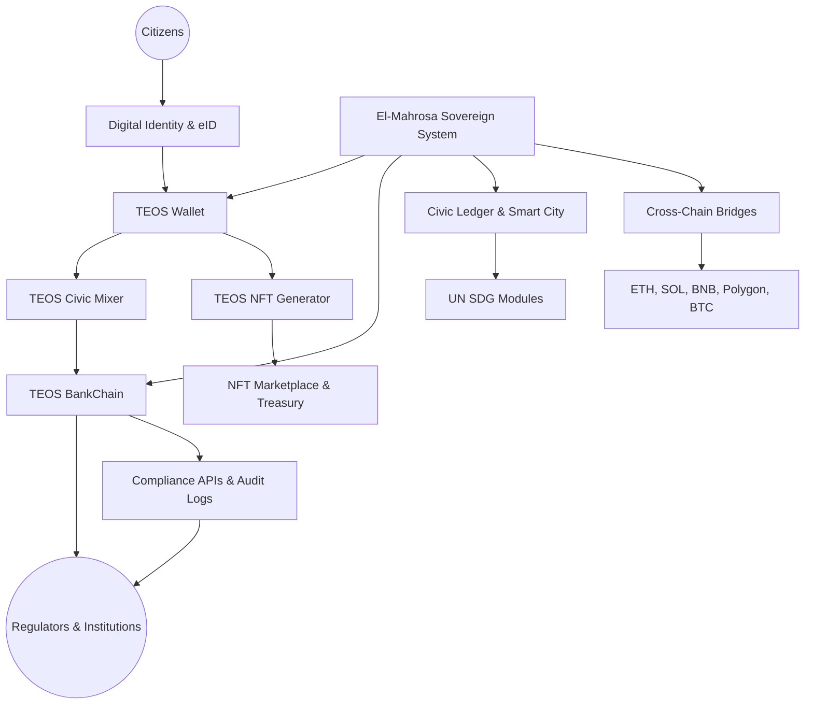

# 📦 Elmahrosa International — TEOS Egypt

### Engineered in Egypt — Built for the World

**Sovereign blockchain infrastructure | Civic impact | Regulator-aligned | Open source**

---

## 🛠️ Organization Stats

Public repos: **43+** · Built solo by Ayman Seif

---

## 📚 Repository Categories

---

## 🧠 Core Sovereign Infrastructure

| Repo                                                                                                                    |                                         Badge                                        | Description                                                          |
| ----------------------------------------------------------------------------------------------------------------------- | :----------------------------------------------------------------------------------: | -------------------------------------------------------------------- |
| [El-Mahrosa.Teos-Sovereign-System](https://github.com/Elmahrosa/El-Mahrosa.Teos-Sovereign-System)                       |                   | Unified civic-first sovereign infrastructure (Rust + Solana + SDKs). |
| [TEOS-Governance](https://github.com/Elmahrosa/TEOS-Governance)                                                         |             | Governance logic & citizen civic modules.                            |
| [International-Civic-Blockchain-Constitution](https://github.com/Elmahrosa/International-Civic-Blockchain-Constitution) |           | Global civic blockchain constitution & governance standards.         |
| [Ask-Teos-AI](https://github.com/Elmahrosa/Ask-Teos-AI)                                                                 |                      | Conversational AI interface for TEOS protocols.                      |
| [Teos-Integration](https://github.com/Elmahrosa/Teos-Integration)                                                       |   | Core integration, compliance, and automation layers.                 |
| [Teos-App-Studio](https://github.com/Elmahrosa/Teos-App-Studio)                                                         |  | TEOS ecosystem app development hub.                                  |

---

## 📊 Compliance & Documentation

| Repo                                                                                |                                     Badge                                    | Description                                         |
| ----------------------------------------------------------------------------------- | :--------------------------------------------------------------------------: | --------------------------------------------------- |
| [TEOS-Egypt-Compliance-Kit](https://github.com/Elmahrosa/TEOS-Egypt-Compliance-Kit) |  | Sovereign-grade compliance & governance frameworks. |

---

## 🌐 Ecosystem Platforms & Services

| Repo                                                                |                                     Badge                                     | Description                         |
| ------------------------------------------------------------------- | :---------------------------------------------------------------------------: | ----------------------------------- |
| [website](https://github.com/Elmahrosa/website)                     |           | Official public website.            |
| [teosegyptweb](https://github.com/Elmahrosa/teosegyptweb)           |              | TEOS web frontend & landing assets. |
| [TEOS-Services-API](https://github.com/Elmahrosa/TEOS-Services-API) |         | Core backend API services.          |
| [TEOS-Payment-Rail](https://github.com/Elmahrosa/TEOS-Payment-Rail) |  | On-chain payment infrastructure.    |
| [TEOS-Token-SPL](https://github.com/Elmahrosa/TEOS-Token-SPL)       |     | SPL minting & token support.        |

---

## 🏦 Banking & Financial Infrastructure

| Repo                                                                        |                                       Badge                                       | Description                                    |
| --------------------------------------------------------------------------- | :-------------------------------------------------------------------------------: | ---------------------------------------------- |
| [Teos-Bankchain](https://github.com/Elmahrosa/Teos-Bankchain)               |   | Decentralized digital banking engine.          |
| [Teos-Civic-Mixer](https://github.com/Elmahrosa/Teos-Civic-Mixer)           |         | Wallet analytics & community transparency.     |
| [Teos-Bankchain-Mobile](https://github.com/Elmahrosa/Teos-Bankchain-Mobile) |  | Mobile interface for digital banking services. |

---

## 🖼️ Civic & Community Platforms

| Repo                                                                                |                                     Badge                                    | Description                                      |
| ----------------------------------------------------------------------------------- | :--------------------------------------------------------------------------: | ------------------------------------------------ |
| [salma-unity-care-hospital](https://github.com/Elmahrosa/salma-unity-care-hospital) |  | Healthcare blockchain system.                    |
| [TeosEgypt-AI-Travel-OS](https://github.com/Elmahrosa/TeosEgypt-AI-Travel-OS)       |            | AI travel OS suite.                              |
| [Teos-Wallet](https://github.com/Elmahrosa/Teos-Wallet)                             |       | Unified digital wallet for governance & finance. |

---

## 🧩 Utility & Supporting Modules

| Repo                                                                                            |                                      Badge                                     | Description                                 |
| ----------------------------------------------------------------------------------------------- | :----------------------------------------------------------------------------: | ------------------------------------------- |
| [teos_contribution_pool_complete](https://github.com/Elmahrosa/teos_contribution_pool_complete) |       | Full contribution pool implementation.      |
| [ERT-LAUNCH](https://github.com/Elmahrosa/ERT-LAUNCH)                                           |      | Token launch tooling and ecosystem starter. |
| [TEOS-NFT-AI-Generator](https://github.com/Elmahrosa/TEOS-NFT-AI-Generator)                     |               | NFT minting & AI generation.                |
| [ElMahrosa-Pi-Smart-City](https://github.com/Elmahrosa/ElMahrosa-Pi-Smart-City)                 |  | PI Network smart-city modules.              |
| [TEOS-AI-Auditor](https://github.com/Elmahrosa/TEOS-AI-Auditor)                                 |        | AI compliance audit engine.                 |
| [Teos-Gold-Reserve](https://github.com/Elmahrosa/Teos-Gold-Reserve)                             |       | Treasury & reserve infrastructure.          |

---

## 🚀 Growth & Civic Expansion

| Repo                                                                                              |                                          Badge                                          | Description                                                |
| ------------------------------------------------------------------------------------------------- | :-------------------------------------------------------------------------------------: | ---------------------------------------------------------- |
| [FPBE-First-Pimisr-Bank-Elmahrosa](https://github.com/Elmahrosa/FPBE-First-Pimisr-Bank-Elmahrosa) |               | Banking services & civic finance modules.                  |
| [Teospump](https://github.com/Elmahrosa/Teospump)                                                 |               | Liquidity & referral engine.                               |
| [Digital-Reconstruction-of-Gaza](https://github.com/Elmahrosa/Digital-Reconstruction-of-Gaza)     |  | Civic reconstruction blueprint for Gaza (Web3 geospatial). |
| [TeosPitaxi](https://github.com/Elmahrosa/TeosPitaxi)                                             |                 | Pi powered transport network.                              |
| [Teos-Pi-Smart-City](https://github.com/Elmahrosa/Teos-Pi-Smart-City)                             |             | Smart city infrastructure suite.                           |
| [TeosEgypt-DomainPlatform](https://github.com/Elmahrosa/TeosEgypt-DomainPlatform)                 |             | Civic domain & identity platform.                          |
| [Elmahrosa-Blockchain](https://github.com/Elmahrosa/Elmahrosa-Blockchain)                         |                   | Shared blockchain utilities.                               |
| [TEOS-MINER-TELEGRAM-BOT](https://github.com/Elmahrosa/TEOS-MINER-TELEGRAM-BOT)                   |                       | Telegram mining & engagement bot.                          |
| [Nilex](https://github.com/Elmahrosa/Nilex)                                                       |                    | Support tooling & utilities.                               |
| [Elmahrosa-Map-of-PI](https://github.com/Elmahrosa/Elmahrosa-Map-of-PI)                           |                            | Geospatial map of PI services.                             |
| [Mine_alltokens](https://github.com/Elmahrosa/Mine_alltokens)                                     |                | Token mining aggregator.                                   |
| [demo-repository](https://github.com/Elmahrosa/demo-repository)                                   |                          | Showcase demo code.                                        |

## 🏛 Elmahrosa Organization

Welcome to the **Elmahrosa Sovereign Ecosystem**, a civic-first blockchain organization built in **Egypt**, designed to scale globally with compliance, sustainability, and institutional trust.

---

## 🔗 Core Repositories

| Repository                           | Purpose                            |
| ------------------------------------ | ---------------------------------- |
| **El-Mahrosa.Teos-Sovereign-System** | National sovereign backbone        |
| **TeosWallet**                       | Non-custodial citizen wallet       |
| **Teos-BankChain**                   | Regulated financial infrastructure |
| **TEOS-NFT-AI-Generator**            | NFT minting & AI generation        |
| **Ask-TEOS-AI**                      | AI blockchain gateway              |

> **All repositories are architected, coded, deployed, and maintained solo by the founder — every commit is self-delivered.**

---

## 🌍 Vision

A **sovereign digital infrastructure layer**, built in Egypt and aligned with:

* **Egypt Vision 2030**
* **UN Sustainable Development Goals**
* **Global audit and compliance standards**

Elmahrosa’s mission is to **anchor Egypt as a founding node in global civic blockchain infrastructure**, contributing to the world’s future constitutional digital layer.

---

## 🧩 System Architecture

---

## 🌍 Overview

**Elmahrosa International** is a civic-first blockchain organization based in Egypt, deploying sovereign platforms that fuse:

* **Regulator-grade compliance**
* **Institutional wallet infrastructure**
* **SDG-measurable impact modules**
* **Cross-chain global interoperability**
* **Audit-ready delivery pipelines**

This ecosystem is built by a **solo founder**, engineered for national sovereignty but structured for **worldwide deployment and adoption**.

---

## ✨ Mission Statement

* **Compliance-First:** Institutional trust through TESL v2.0 licensing, audit logs, and governance automation.
* **Empowerment:** Deliver secure blockchain infrastructure for citizens, banks, fintechs, and civic institutions.
* **Global Scalability:** Architected in Egypt, deployable anywhere — from Africa to the Middle East, Europe, and the Americas.
* **Civic Leadership:** Position Egypt as a **co-author and infrastructure contributor** to global civic blockchain evolution.

---

## 🏛 Core Values

* **Integrity:** Transparent governance, verifiable commits, regulator alignment.
* **Excellence:** Audit-ready repositories, tested and production-hardened.
* **Sustainability:** Every module delivers measurable SDG impact.
* **Sovereignty:** Built in Egypt, owned by Egyptians, serving global infrastructure needs.

---

## 🔧 Key Areas of Focus

* **Bank-Facing Crypto Gateways:** Wallet onboarding, treasury, staking, settlement, compliance dashboards.
* **SDG Modules:**

  * Carbon & climate tracking (SDG 13)
  * Smart agriculture & food security (SDG 2)
  * Digital education (SDG 4)
  * Circular economy & sustainability (SDG 12)
* **Global Deployment Models:** SaaS, white-label, institutional pilots, and cross-chain expansions.

---

## 🌐 Current Projects

* **TEOS NFT dApp (Pi Network):** Egyptian-branded NFT minting, petition-first onboarding, staking rewards, treasury flows, marketplace.
* **TEOS BankChain:** Global pilot for regulated banking integration.
* **Governance Automation:** Audit dashboards, contributor credentials, deployment integrity checks.

---

## 🚀 Deployments

* **PiNet sovereign demos** for institutional review
* **TEOS NFT platform**
* **BankChain global pilot**
* **Governance & compliance dashboards**

---

## 🔐 Compliance & Standards

---

## 📜 Licensing

**TESL v2.0** enforced across all repos
*Audit-ready · regulator-aligned · evergreen infrastructure*

---

## 📬 Contact & Verification

**Ayman Seif** — Founder & Sole Developer

* **Email:** [ayman@teosegypt.com](mailto:ayman@teosegypt.com)
* **Phone:** +20 1006167293
* **Solana Wallet:** Akvm3CbDN448fyD8qmQjowgBGpcYZtjuKFL4xT8PZhbF
* **TEOS Token Mint:** AhXBUQmbhv9dNoZCiMYmXF4Gyi1cjQthWHFhTL2CJaSo
* **Telegram :** @Elmahrosapi

---

# 🏅 Founder Badges

**Solo founder delivering sovereign infrastructure with global scale:**

*Architecting and coding every civic-first module.*

*Enforcing TESL v2.0 and audit integrity.*

*Designing measurable UN SDG impact modules.*

*Managing staking, rewards, and treasury flows.*

*Scaling Egypt’s blockchain infrastructure worldwide.*

---

---

## 📬 Contact & Verification

**Founder:** Ayman Seif
📧 [ayman@teosegypt.com](mailto:ayman@teosegypt.com)
📱 +20 1006167293

**Solana Wallet:** `Akvm3CbDN448fyD8qmQjowgBGpcYZtjuKFL4xT8PZhbF`
**TEOS Token Mint:** `AhXBUQmbhv9dNoZCiMYmXF4Gyi1cjQthWHFhTL2CJaSo`

---

### **Every commit is a civic milestone.**

### *Built solo in Egypt — scaled for the world.*

---
